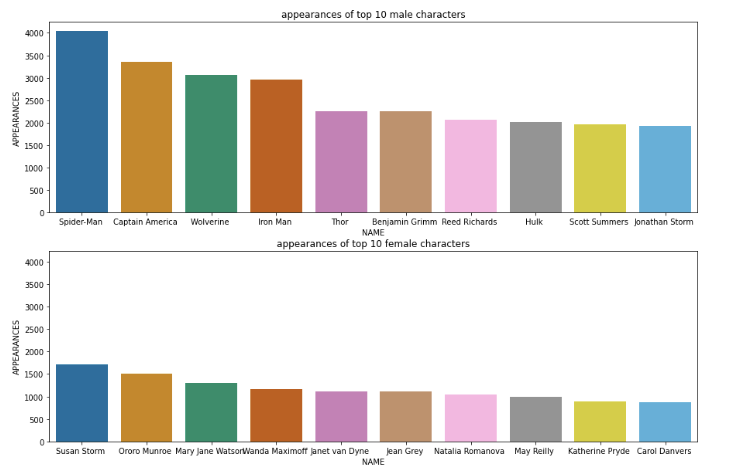
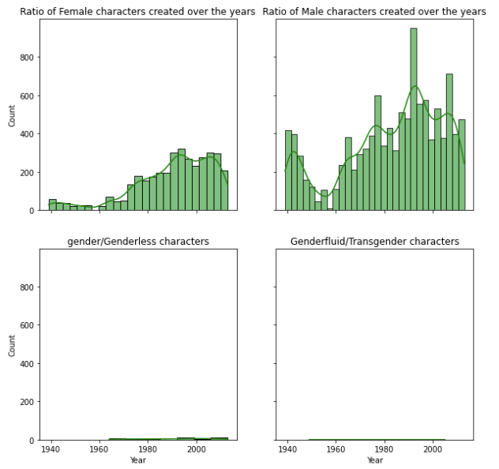

<h1>Gender Representation in Marvel's comic books</h1>

With the data analysis from a dataset of Wikipedia, we were able to make static graphs that show the top 10 appearances of characters and the ratio between female and male characters that are created over the year.
 

In the first graph, it is clear that male characters have more appearances in the comic books than female characters have. Men appear approximately twice as much as women. With this information, we can suggest that the gender representation in the comic books is not that good.

In the graphs above, we did not only look at the ratio between created female and male characters, but also looked at genderless, genderfluid and transgender characters.  
Over the years, there are less female characters created than male characters, maybe twice as less or more. This shows again that the gender representation between female and male characters is not equal. If we compared other genders with male and even female characters, it is even worse.  
A fraction of characters are genderless, but our idea is that these characters are aliens, robots or another type of species. The genderfluid or transgender characters are also in a big minority compared to male and even female characters.

  

